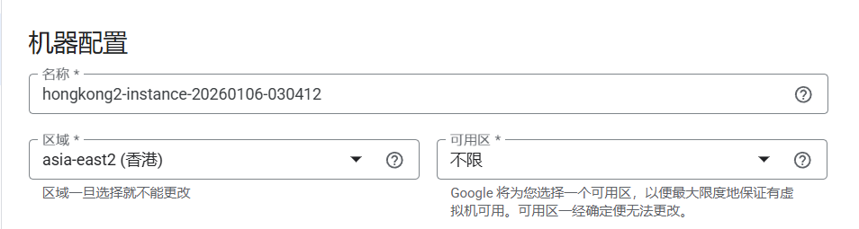
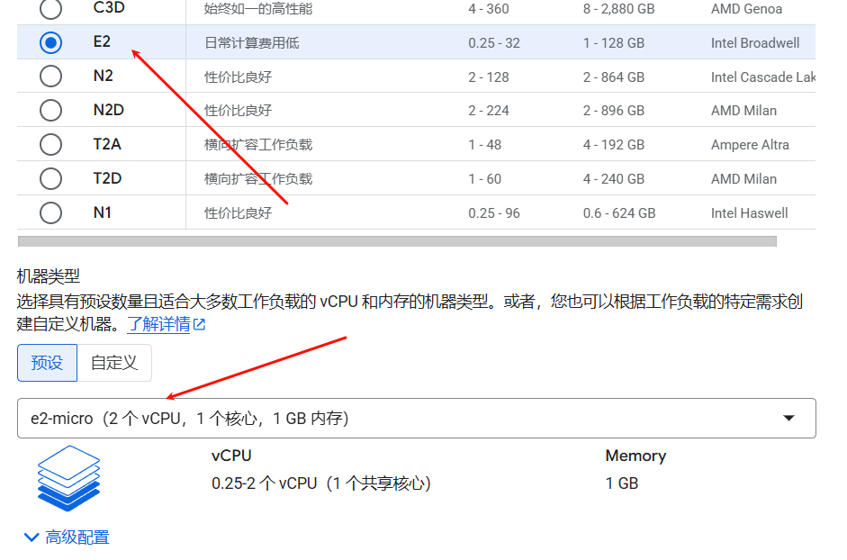
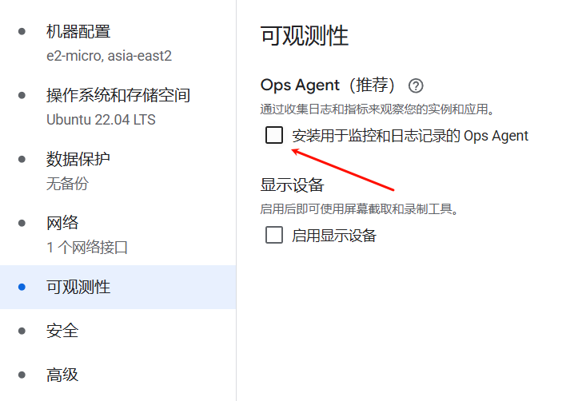
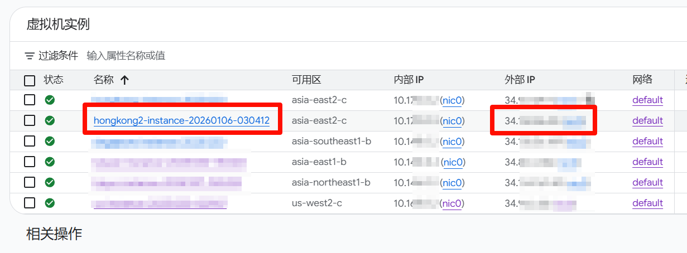
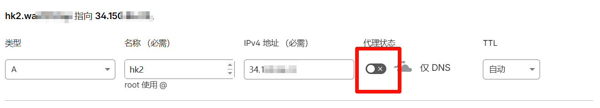
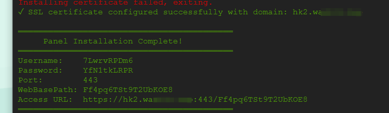
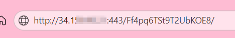
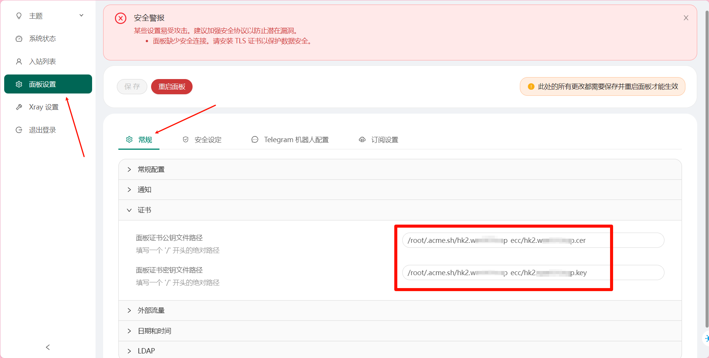
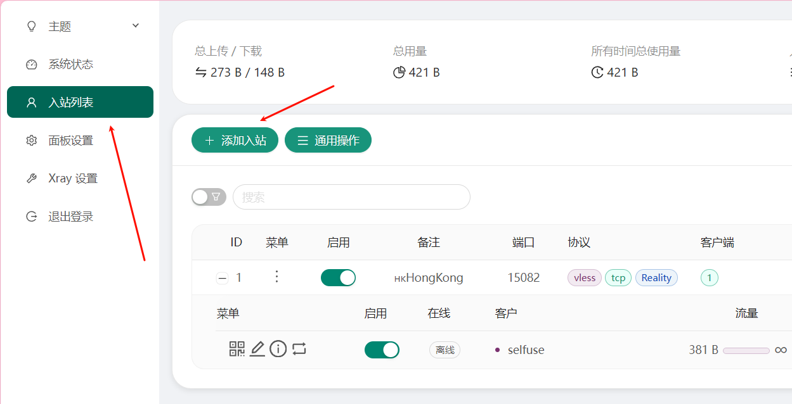
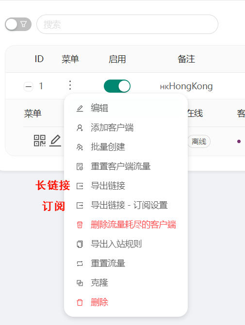

## 面板搭建

在谷歌云新建一台实例，E2 的性能就足够了





建议关闭 `Ops Agent`，否则可能会导致网卡数据异常，因为会上传监控数据给 Google，但权限不足，会反复上传



查看实例 ip 并复制



在 [CloudFlare](https://dash.cloudflare.com) 将域名解析到服务器的 ip 地址，关闭小黄云



SSH 连接到实例，记得防火墙打开 22 端口，谷歌默认入站端口全部关闭，出站全部打开

依次输入命令


```shell
sudo -i
sudo timedatectl set-timezone Asia/Shanghai
bash <(curl -Ls https://raw.githubusercontent.com/mhsanaei/3x-ui/master/install.sh)
```

选择自定义端口为 443，输入刚才 DNS 解析到此服务器 ip 的域名



访问面板



配置面板 https



新建入站




