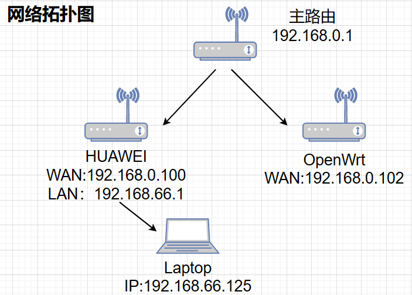
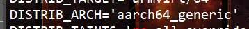
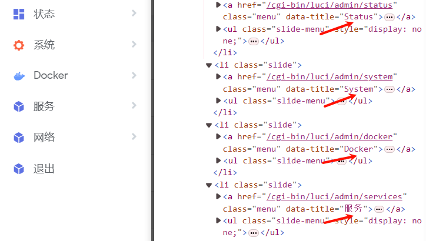
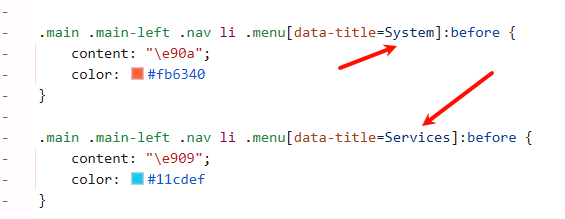
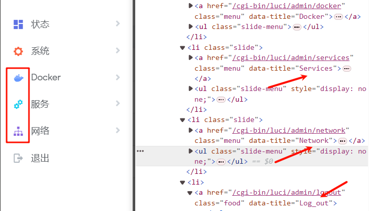

## 防火墙

- [x] 删除在OpenWrt防火墙中的自定义规则会导致局域网访问缓慢、卡顿

  ```bash
  iptables -t nat -A PREROUTING -p udp --dport 53 -j REDIRECT --to-ports 53
  iptables -t nat -A PREROUTING -p tcp --dport 53 -j REDIRECT --to-ports 53
  ```

- [x] 局域网访问



默认设置下，**Laptop** 可以访问 **HUAIWEI** 和 **主路由**，但无法访问 **OpenWrt**，更改防火墙中设置WAN口入站数据为接受后可以访问。

---

## SSH

- [x] TTYD终端拒绝连接

第一种：

编辑TTYD的配置文件

`vim /etc/init.d/ttyd`

注释

`#${interface:+-i $interface}`

重启TTYD

`/etc/init.d/ttyd restart`

第二种：

编辑 `/etc/config/ttyd`

更改 `option interface '@lan'`中的`@lan`为合适接口

---

## iStore

- [x] 手动安装失败

  终端下查看编译的架构版本`cat /etc/openwrt_release`

  

  更改OPKG配置

```bash
dest root /
dest ram /tmp
lists_dir ext /var/opkg-lists
option overlay_root /overlay
# option check_signature

arch all 100
arch aarch64_generic 200
arch aarch64_cortex-a53 300
```

---

## 主题

- [x] 导航栏图标不匹配

使用浏览器检查元素





原因为 `data-title` 的值在 **html** 和 css 中不匹配，**css** 无法正确选择。

更改后显示正常



最后找到 html 源文件进行更改就行了。找不到 html 文件也可以修改 `/www/luci-static/argon/css/` 目录下的 css 文件。

修改后清除其在浏览器中的缓存生效。

---

