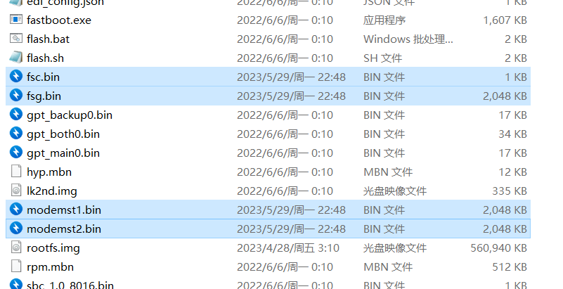
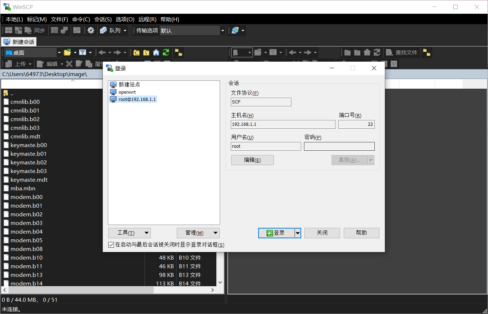
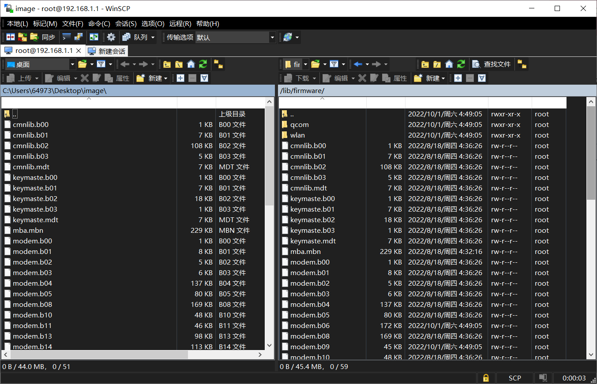
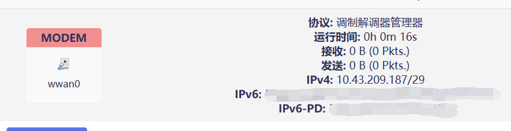
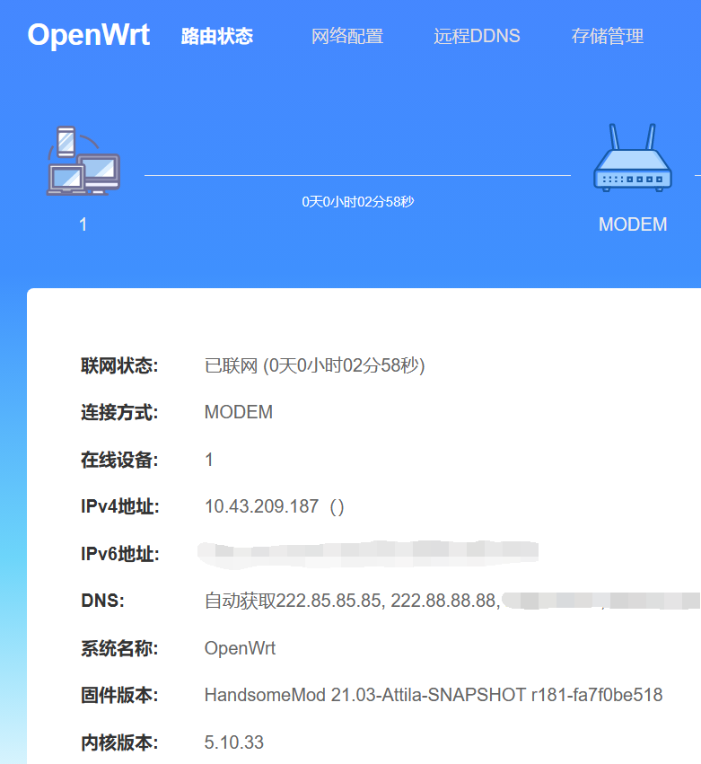

### OpenWrt

#### # SIM卡网络异常

确保板子在 **Android系统** 下能正常使用SIM卡，进9008用Qualcomm Premium Tool备份`modemst1`、`modemst2`、`fsc`、`fsg`、`modem`五个分区，其中`modem`分区备份出的**NON-HLOS.bin**用7Z解压得到`image`文件夹。

前四个分区备份的文件改扩展名为`.bin`

替换一键刷入包中的四个文件后刷入

用WinSCP连接

将**image**文件夹中的全部文件上传到**/lib/firmware,**全部替换！

重启设备

有网络，但是好像接受和发送一直是0B

